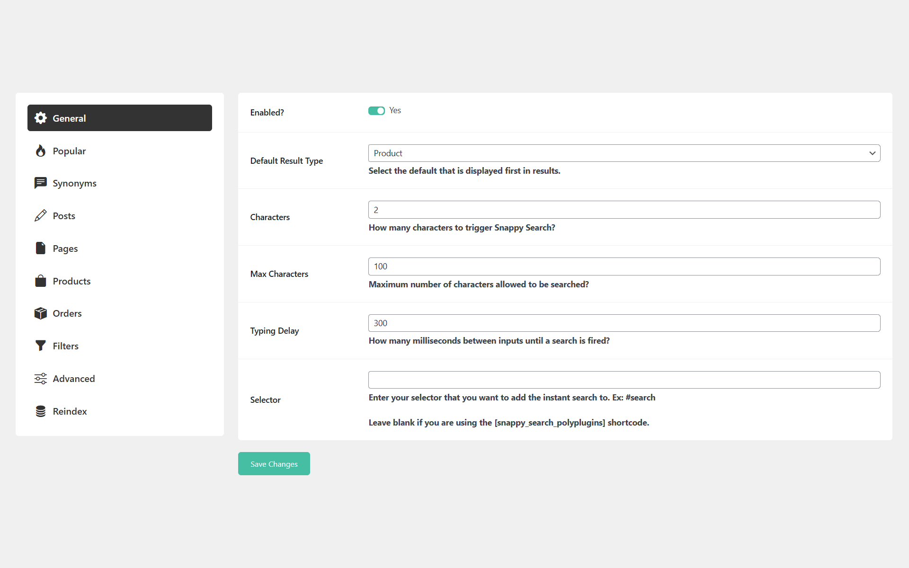

## About

Speedy Search is a powerful and lightweight search plugin that enhances your site’s search functionality with lightning-fast results. Powered by [TNTSearch](https://github.com/teamtnt/tntsearch), it indexes your WordPress posts for instant, accurate, and efficient searching. Say goodbye to slow searches—this plugin ensures a seamless user experience with real-time suggestions and improved relevancy. Perfect for blogs, news sites, and content-heavy websites.

## Currently Supports

* Instantly Searching WordPress Posts
* Advanced repo search for finding plugins and themes. [Demo](https://www.polyplugins.com/repo-search/)

## Features

* Adds a dropdown by defined selector to search form to show results
* Search through all posts fast without requiring multiple page loads
* Builds an index of all posts
* Background sync to index posts
* Ability to adjust the batch size for the initial index so smaller servers don't get overloaded
* Limit the number of results displayed
* Adds `/wp-json/speedy-search/v1/posts` endpoint to get array of post ids

## Road Map

* Add support for WooCommerce
* Add support for pages
* Add integration with Admin Instant Search

## GDPR

We are not lawyers and always recommend doing your own compliance research into third-party plugins, libraries, etc., as we've seen other plugins not be in compliance with these regulations.

This plugin uses the Bootstrap, BootStrap Icons, and SweetAlert2 third-party libraries. These libraries are loaded locally to be compliant with data protection regulations. This plugin also uses TNTSearch.

This plugin collects and stores certain data on your server to ensure proper functionality. This includes:

* Storing plugin settings
* Remembering which notices have been dismissed

## Screenshots

## Installation

1. Backup WordPress
2. Upload the plugin files to the `/wp-content/plugins/` directory, or install the plugin through the WordPress plugins screen directly.
3. Activate the plugin through the 'Plugins' screen in WordPress
4. Configure the plugin

## Frequently Asked Questions

### How long will it take to index?

By default, it will index 10 posts per minute.

## Changelog

### 1.0.1
- Added: Repo Advanced Search

### 1.0.0
- Initial Release