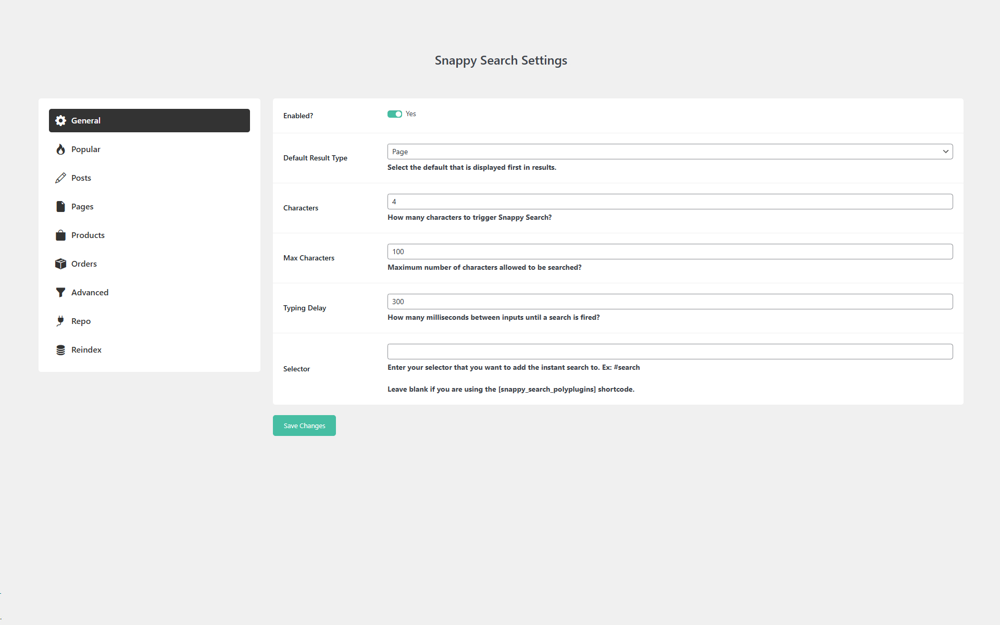
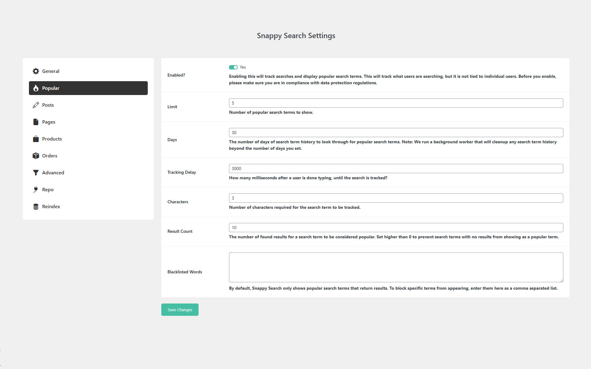
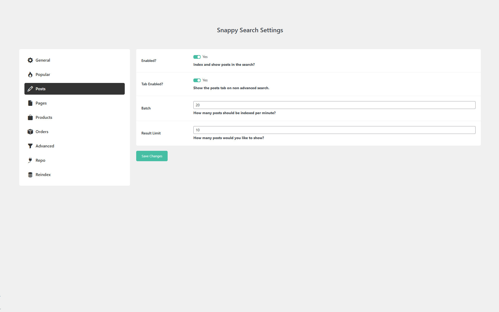
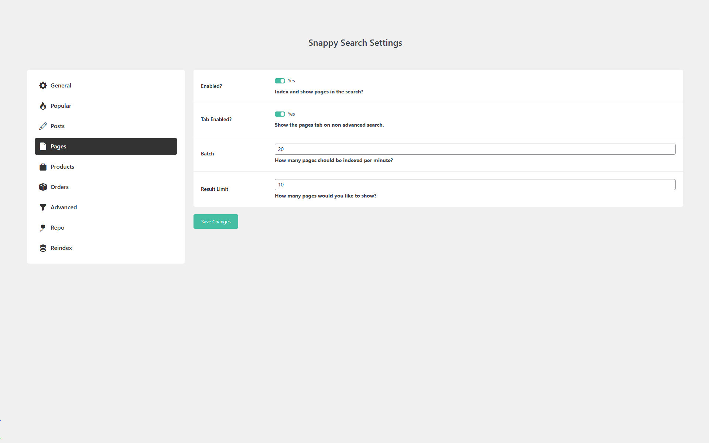
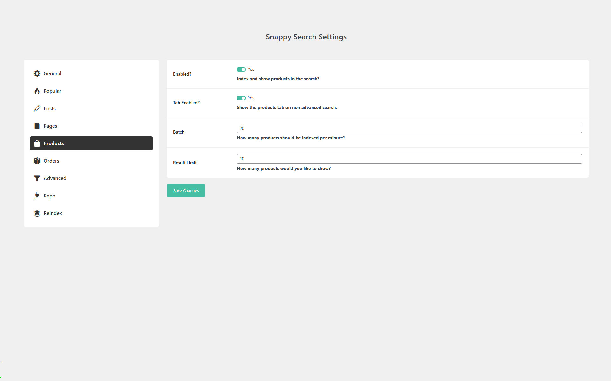
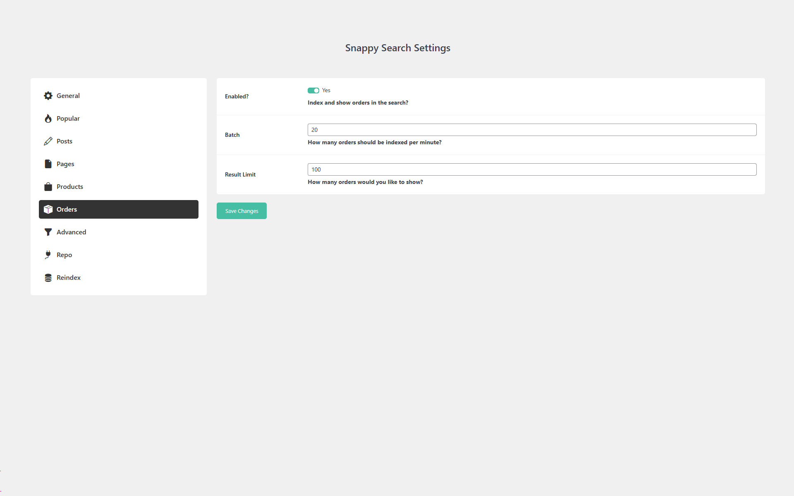

## About

Snappy Search is a powerful and lightweight AJAX search plugin that enhances your site's search functionality with lightning fast results. Powered by [TNTSearch](https://github.com/teamtnt/tntsearch), it indexes your WordPress posts, pages, products, and downloads for instant, accurate, and efficient searching. Say goodbye to slow searches, this plugin ensures a seamless user experience with improved relevancy. Perfect for blogs, news sites, and content heavy websites. For even faster search performance, install our [Snappy Search Enhancements](https://www.polyplugins.com/product/snappy-search-enhancements/) MU plugin to disable unnecessary plugins during search requests.

## Currently Supports

* Instantly searching WooCommerce products
* Instantly searching Easy Digital Downloads downloads
* Instantly searching WordPress Posts
* Instantly searching WordPress Pages
* Advanced repo search for finding plugins and themes. [Demo](https://www.polyplugins.com/repo-search/)

## Features

* Search through all posts fast without requiring multiple page loads
* Set how many characters to trigger the AJAX search
* Set a typing delay before an AJAX request is made
* Tab selection between various indexes if more than one is enabled
* Adds a dropdown by defined selector to search form to show results
* Can build indexes for products, downloads, posts, and pages
* Background sync for indexes
* Index updater that handles when data is added, updated, removed, set to draft, or visibility hidden.
* Ability to adjust the batch size for the initial index so smaller servers don't get overloaded
* Limit the number of results displayed
* [NEW] Popular search terms can be displayed below the search
* [NEW] Add your own custom shortcode template by copying snappy-search-form.php to your theme folder
* Reindexer button
* Shortcode [snappy_search_polyplugins placeholder="Search..."] to inject a Snappy Search form anywhere
* Shortcode [snappy_search_mobile_polyplugins] to inject a mobile Snappy Search form anywhere
* Shortcode [snappy_search_advanced_polyplugins] to inject an advanced Snappy Search form anywhere
* /wp-json/snappy-search/v1/products endpoint to get array of product ids (Requires WooCommerce)
* /wp-json/snappy-search/v1/downloads endpoint to get array of download ids (Requires EDD)
* /wp-json/snappy-search/v1/posts endpoint to get array of post ids
* /wp-json/snappy-search/v1/pages endpoint to get array of page ids

## Road Map

* Add support for using the WP DB instead of SQLite since TNTSearch supports it
* Add analytics for 0 search items and other things
* Add scroll to load more results
* Add logging class from our other plugins
* Add another shortcode for replacing advanced search
* Add ability for admin side nav to jump to sub settings

## GDPR

We are not lawyers and always recommend doing your own compliance research into third-party plugins, libraries, etc., as we've seen other plugins not be in compliance with these regulations.

This plugin uses the Bootstrap, BootStrap Icons, and SweetAlert2 third-party libraries. These libraries are loaded locally to be compliant with data protection regulations. This plugin also uses TNTSearch.

This plugin collects and stores certain data on your server to ensure proper functionality. This includes:

* Storing plugin settings
* Remembering which notices have been dismissed
* Storing search terms made by users when enabled

## Screenshots

## Installation

1. Backup WordPress
2. Upload the plugin files to the `/wp-content/plugins/` directory, or install the plugin through the WordPress plugins screen directly.
3. Activate the plugin through the 'Plugins' screen in WordPress
4. Configure the plugin

## Frequently Asked Questions

### How long will it take to index?

By default, it will index 10 posts per minute.

## Changelog

### 1.3.0
* Added: Support for using the WP DB instead of SQLite since TNTSearch supports it
* Added: Database type setting
* Added: Shortcode [snappy_search_mobile_polyplugins] in case of needing another search form for mobile
* Added: Shortcode [snappy_search_advanced_polyplugins] for replacing advanced search
* Added: Better handling for indexing fallback
* Added: Skeleton loader
* Added: Initial loading indicator
* Added: Additional styling
* Updated: Fall back to default WordPress search when indexing
* Updated: Translations
* Bugfix: If using multiple search forms, only the first one works
* Optimized: Indexing logic

### 1.2.0
* Added: Custom template for shortcode search so the layout can be changed. Add your own custom template by copying snappy-search-form.php to your theme folder
* Added: Popular searches that display under the search form
* Added: Popular search enable setting
* Added: Popular search limit setting to only show top X number of popular search terms below the form
* Added: Popular days setting for the number of days of search term history to look through for popular search terms
* Added: Popular tracking delay setting to handle triggering tracking search after it's been completed, this must be larger than typing delay
* Added: Popular search character setting for preventing non words from showing in popular search terms
* Added: Popular result count setting to prevent search terms with no or low results from showing
* Added: Popular blacklist setting to block specific search terms from showing as popular
* Added: Cron that cleans up popular searches table based on number of days for a search term to be considered popular
* Added: Handling for creating the new popular search term table
* Added: Max character setting under general to limit the length of search terms
* Updated: Endpoint names with old endpoints still being accessible, but they will be removed in the future, so please update references if you are using them outside of this plugin
* Updated: TNTSearch to 5.0.1
* Updated: Translations
* Moved: Activation logic to it's own classes
* Moved: Snappy Search settings to top level

### 1.1.0
* Added: Support for WooCommerce Products
* Added: Support for Easy Digital Downloads
* Added: Support for Pages
* Added: Shortcode [snappy_search_polyplugins] to inject a Snappy Search form anywhere
* Added: Index updater that handles when data is added, updated, removed, set to draft, or visibility hidden.
* Added: Reindex button to settings
* Added: Characters and Typing Delay options under General settings
* Added: Enabled option under various index types
* Added: Tab navigation to search if showing more than one index
* Updated: Name to Snappy Search
* Bugfix: Cron jobs may not register during activation

### 1.0.1
* Added: Repo Advanced Search

### 1.0.0
* Initial Release